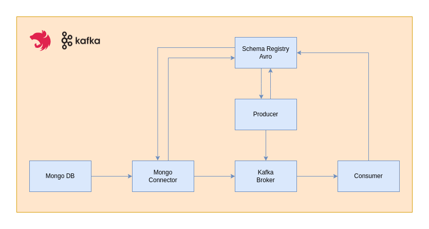

# NestJS + Kafka Connect

This repository is a simple demonstration of how to make a data integration using Kafka connect and the nestJS framework. This project covers 2 basic scenarios where there is a Kafka broker to manage the event, one MongoDB connector, one application that works as a producer, and one application that works as a consumer. The image below represents all of these scenarios.



### Requirements

- Node and npm
- Docker and docker-compose

### How to start the projects

- Start all containers

```bash
docker-compose up -d
```

- Consumer application

```bash
cd ./consumer

npm install

npm run start:dev
```

- Producer application

```bash
cd ./producer

npm install

npm run start:dev
```

### How to try scenarios

- Producer Application

```bash
curl --location --request GET 'http://localhost:3000/kafka-connect' \
--header 'Content-Type: application/json' \
--data-raw '{
    "quote_id": "uuid_postman",
    "plan_price": 159.99,
    "created_at": 1651475252,
    "updated_at": 1651475252
}'
```

- MongoDB

Just to insert a new document like this one:

```json
{
  "quote_id": "uuid_mongodb",
  "plan_price": 179.99,
  "created_at": 1651475252,
  "updated_at": 1651475252
}
```
